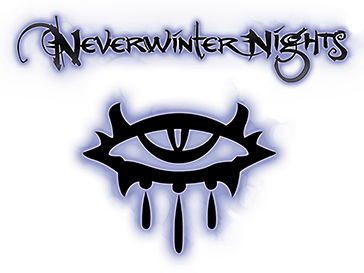

# Welcome!

This is a personal blog for *Neverwinter Nights* content. 

---

## Highlights

**[The Search Tool](vault_search/big_search.md)**

{: .summary}
> Find community-made adventures more easily. Sort and filter by popularity, tags, and more.

**[Poplar's Overrides](poplars_overrides/index.md)**

{: .summary}
> Replay the original game with a new spin. Overhauls character classes and races.

**[Module Recommendations](module_genres/index.md)**

{: .summary}
> Find more adventures you'll like. Hand-curated lists of community modules by genre.

**[Tutorials](tutorials/index.md)**

{: .summary}
> A how-to guide on making your own overrides. Covers topics like making spears one-handed.

<!-- ## The Game

*Neverwinter Nights* was first published in 2002 and has remained surprisingly popular in the decades that followed. Much of this is owed to the expansive toolkit that came with the game, allowing players to create their own adventures.

Nearly **3,000** community-made adventures are freely available for download, to say nothing of more traditional "mods" that change gameplay.

 -->
