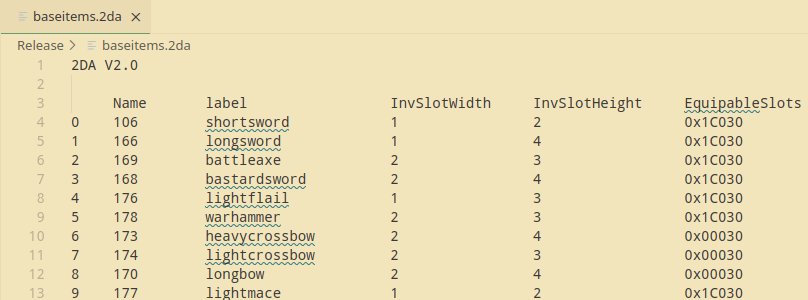
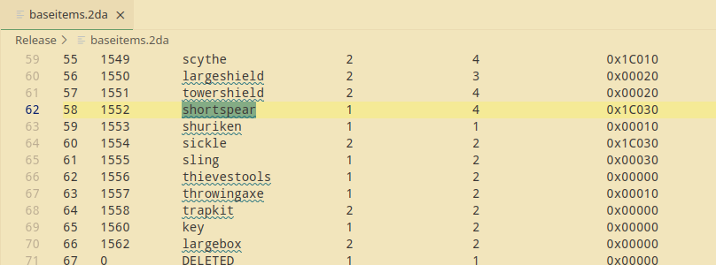
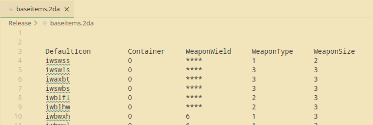
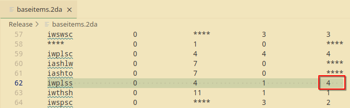
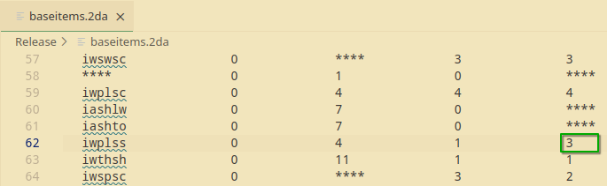
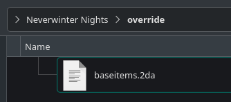
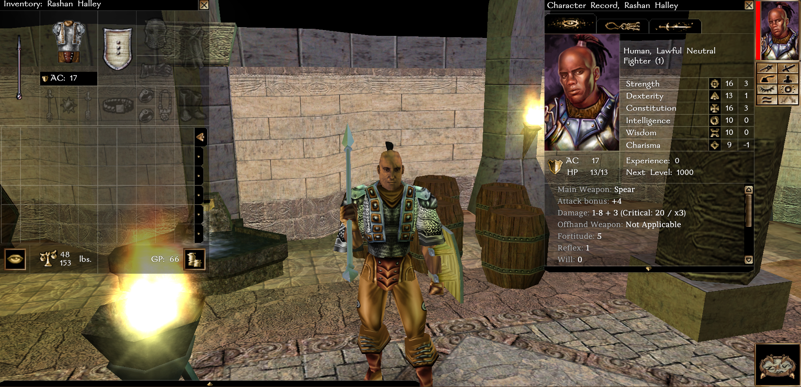

# One Handed Spears

{: .summary}
> Estimated Time: 10 minutes
> 
> Changes spears to be one-handed weapons.

### What You'll Need

* A text editor (Notepad, Notepad++, [VS Code](https://code.visualstudio.com/download))
* The `baseitems.2da` file from [here](https://neverwintervault.org/project/nwnee/other/nwn-ee-819334-full-2da-source)

---

### Step 01: Open baseitems.2da

### Step 02: Find "shortspears"

### Step 03: Change "WeaponSize" From 4 to 3

### Step 04: Move baseitems.2da To The Override Folder

{: .summary}
> * If you're on Windows, the folder is at `My Documents\Neverwinter Nights\override`.
> * If you're on Linux, the folder is at `~/.local/share/Neverwinter Nights/override`.

### Step 05: Test Your Changes

---

## Summary

* We are overriding the size of spears (details [here](https://nwn.wiki/spaces/NWN1/pages/38174935/baseitems.2da)).
  * Spears can now be equipped in one hand with a shield.