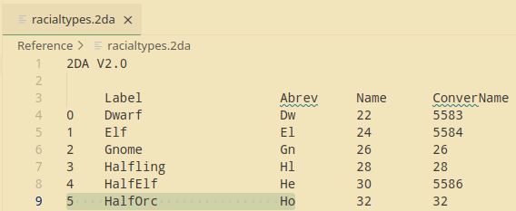
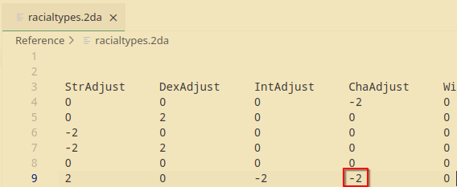
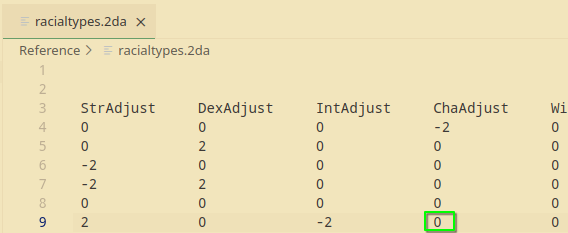
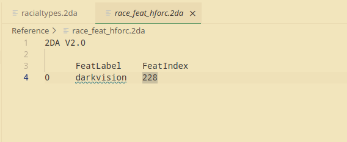
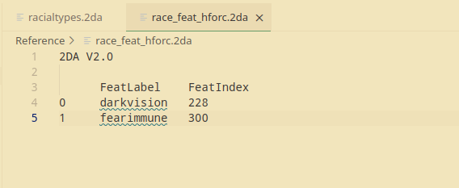

# Better Half Orcs

{: .summary}
> Estimated Time: 20 minutes
> 
> Gives half-orcs immunity to fear and removes their Charisma penalty.

### What You'll Need

* A text editor (Notepad, Notepad++, [VS Code](https://code.visualstudio.com/download))
* A few 2DA files from [here](https://neverwintervault.org/project/nwnee/other/nwn-ee-819334-full-2da-source)
  * `racialtypes.2da`
  * `race_feat_horc.2da`

---

### Step 01: Open racialtypes.2da

### Step 03: Change "ChaAdjust" from -2 to 0 for Half-Orcs

### Step 04: Open race_feat_horc.2da

### Step 05: Add Fear Immunity

{: .summary}
> * The "FeatIndex" points to a row in `feats.2da` (not required, but useful to reference). 
> * Row 300 is "Aura of Courage", a Paladin ability that provides immunity to fear.
> * The starting numbers and "FeatLabel" don't do anything.

### Step 06: Move Files to the Override Folder

{: .summary}
> * If you're on Windows, the folder is at `My Documents\Neverwinter Nights\override`.
> * If you're on Linux, the folder is at `~/.local/share/Neverwinter Nights/override`.

### Step 07: Test Changes

---

## Summary

* We are overriding the ability scores and starting feats for half orcs (details [here](https://nwn.wiki/spaces/NWN1/pages/38175033/racialtypes.2da)).
  * Half-Orcs no longer have a -2 to Charisma.
  * Half-Orcs are now immune to fear (*Aura of Courage*).

{: .note}
> These changes only apply to **new characters**. Loading an existing save won't change that character's feats.
